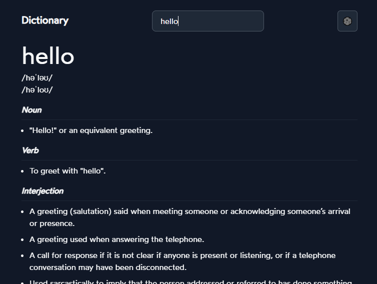

# Dictionary

Dictionary is a simple app that allows you to search for words and their definitions. It uses the [Free Dictionary API](https://dictionaryapi.dev/) to get the data.

[Live site](https://dictionary-facundo.vercel.app/)

## Screenshots

## Tech Stack

**Client:** React, Vite.js, Tailwind CSS, React Query

**Deploy:** Vercel

## Acknowledgements

- [Tailwind CSS Docs](https://tailwindcss.com/docs/installation)
- [React Query Docs](https://react-query.tanstack.com/docs/overview)

## Author

- [Facundo Perez Montalvo](https://facuperezm.com)

